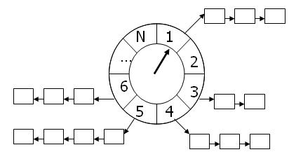

### 时间轮
大量的调度任务如果每一个都使用自己的调度器来管理任务的生命周期的话，浪费cpu的资源并且很低效。

时间轮是一种高效来利用线程资源来进行批量化调度的一种调度模型。把大批量的调度任务全部都绑定到同一个的调度器上面，使用这一个调度器来进行所有任务的管理（manager），触发（trigger）以及运行（runnable）。能够高效的管理各种延时任务，周期任务，通知任务等等。

缺点，时间轮调度器的时间精度可能不是很高，对于精度要求特别高的调度任务可能不太适合。因为时间轮算法的精度取决于，时间段“指针”单元的最小粒度大小，比如时间轮的格子是一秒跳一次，那么调度精度小于一秒的任务就无法被时间轮所调度。而且时间轮算法没有做宕机备份，因此无法再宕机之后恢复任务重新调度。

ref: https://www.cnblogs.com/luozhiyun/p/12075326.html